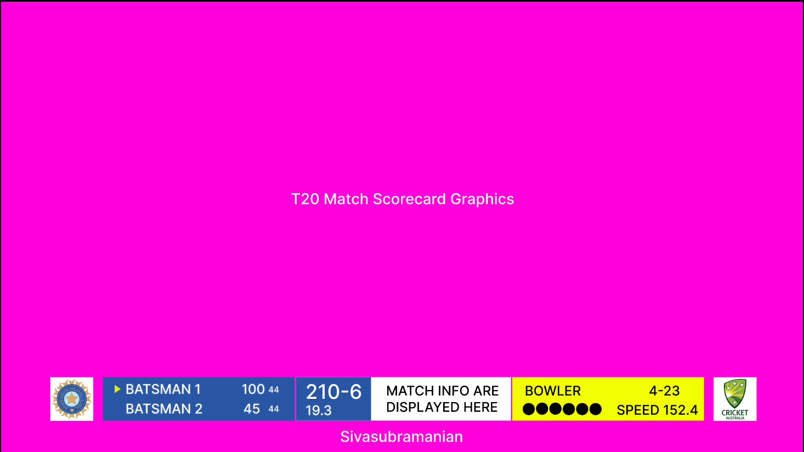
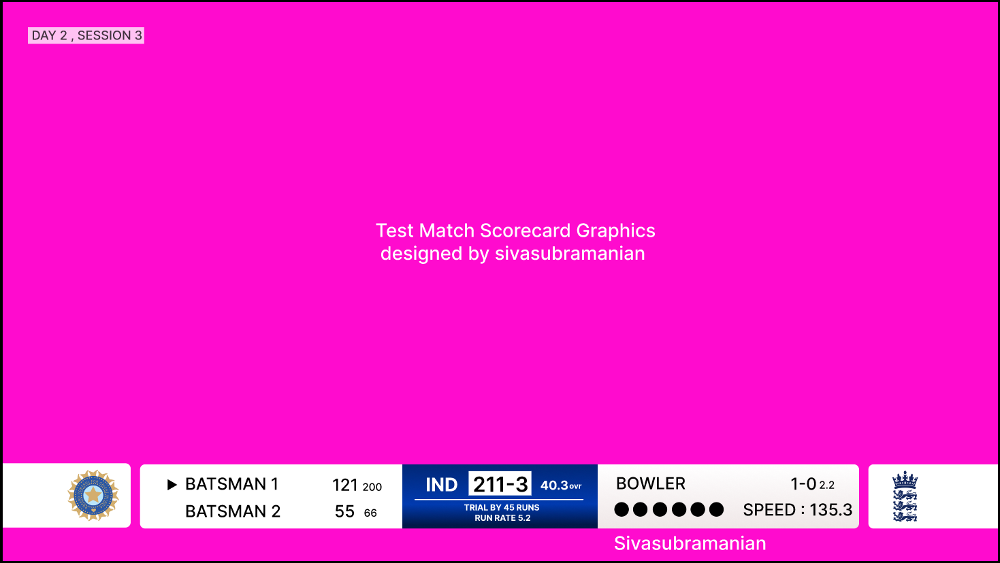

🏏 Cricket Scorecard Redesign (T20 & Test)

This is a personal UI/UX project where I redesigned the live cricket scorecard layout typically seen on Indian broadcasts like JioCinema and Star Sports. 

🎯 Objective
To create a cleaner, more informative, and modern scorecard design inspired by viewer feedback and comparisons with international designs (like ECB's).

📦 Project Includes
- T20 Scorecard Design
- Test Match Scorecard Design
- Figma Wireframes & Layouts
- Mockups (TV and Mobile)
- Feedback survey insights

 🛠 Tools Used
- Figma
- Canva (for mockups)
- Google Forms (for feedback collection)

📸 Previews

👋 Author
**Sivasubramanian**  
[LinkedIn Profile](www.linkedin.com/in/sivasubramanian8)  
Feel free to connect or share feedback!
